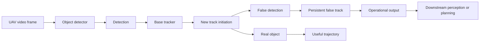
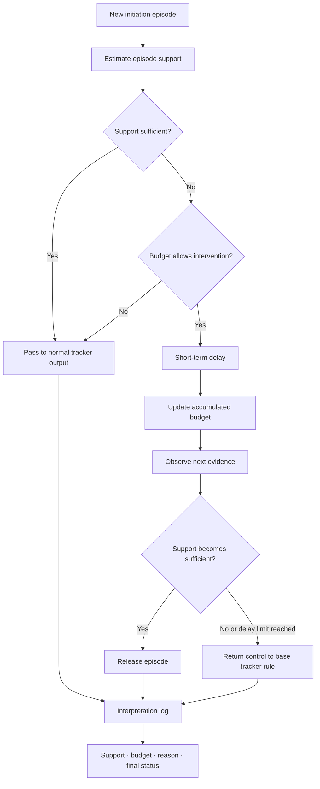
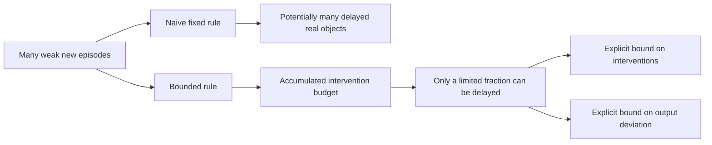
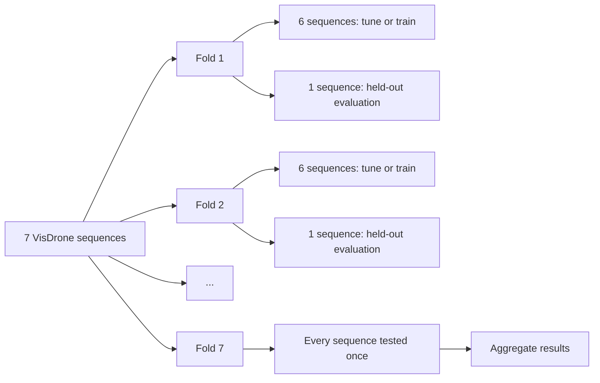
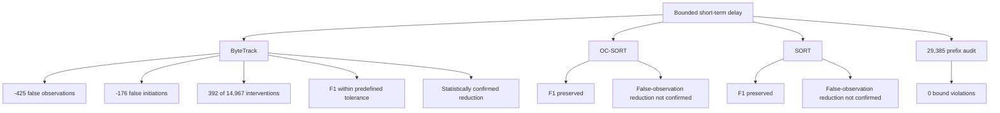

# Defense4UAVSwarm

**Interpretable bounded control of track initiation in UAV perception**

A reproducible study of a practical multi-object-tracking question:

> Can we reduce false track initiations by briefly delaying low-support new
> tracks while bounding the amount of intervention in advance?

- **Dataset:** VisDrone
- **Trackers:** ByteTrack · OC-SORT · SORT
- **Validation:** 7-sequence external validation
- **Primary positive result:** ByteTrack
- **Formal bound audit:** 29,385 prefixes · 0 violations
- **Computational closure:** [q1-practical-closure-v7](https://github.com/lebedeffson/Defense4UAVSwarm/tree/q1-practical-closure-v7) at `06d2870`

### Кратко

Исследование проверяет, можно ли уменьшить число ложных инициаций треков в
видеопотоке БПЛА, ненадолго задерживая только эпизоды с низкой поддержкой.
Накопительный бюджет заранее ограничивает число таких вмешательств, а журнал
решений позволяет проследить причину каждой задержки.

## Why This Research Matters

An isolated detector error becomes more consequential when a tracker assigns it
an identity and propagates it through time. Raising the detector threshold can
remove false detections, but may also discard small, distant, or occluded real
objects.



A one-frame false detection becomes more consequential after the tracker assigns
it an identity and begins propagating it through time. The planning module itself
was not modelled in this study.

## Research Question

The study asks whether a wrapper around an unchanged base tracker can briefly
delay only weak new-track episodes, reduce false output, keep F1 within a
predefined tolerance, and enforce an explicit limit on intervention.

## Proposed Method

The Selective Trust Quarantine v2.1 wrapper estimates support when a track is
initiated. Sufficiently supported episodes pass immediately. A weak episode is
delayed only if the accumulated budget permits it; subsequent evidence releases
the episode or returns control according to the finite delay rule. The method is
not a permanent rejection rule.



The wrapper does not replace ByteTrack, OC-SORT, or SORT, and it does not use a
learned classifier.

## Why The Intervention Is Bounded



The budget is not only a performance heuristic. It provides an explicit upper
bound on how far the wrapper may deviate from the base tracker. The prefix audit
checks

```text
D_actual(n) <= L_Q N_Q(n) <= L_Q floor(b_0 + sum_{k=1..n} q_k).
```

## Experimental Protocol

Seven VisDrone video sequences form seven external folds. In every fold, six
sequences are used for parameter selection or RF training and the remaining
sequence is held out for evaluation. Each sequence is tested exactly once.



The held-out sequence is excluded from training, threshold selection, and budget
tuning. RF is fitted again inside each outer fold. Online features use only
information available by the decision frame; future frames and final tracklet
length are prohibited.

## Main Findings

The confirmed positive result is tracker-specific: it was obtained for
ByteTrack. F1 was preserved for OC-SORT and SORT, but a statistically robust
reduction in false observations was not confirmed for those trackers.



## Key Numerical Results

| Result | Value |
| --- | ---: |
| Track-initiation episodes, ByteTrack | 14,967 |
| Delayed episodes | 392 |
| Intervention share | 2.62% |
| False observations | 46,368 → 45,943 |
| False observations removed | 425 |
| False initiations | 10,031 → 9,855 |
| False initiations removed | 176 |
| Prefixes audited | 29,385 |
| Bound violations | 0 |
| Additional bounded-delay runtime | 0.901 ms/frame |

| Tracker | Baseline F1 | Bounded-delay F1 | Main conclusion |
| --- | ---: | ---: | --- |
| ByteTrack | 0.403972 | 0.404400 | False observations reduced with F1 within tolerance |
| OC-SORT | 0.392258 | 0.392276 | Quality preserved; robust FP reduction not confirmed |
| SORT | 0.391946 | 0.391942 | Quality preserved; robust FP reduction not confirmed |

These numbers do not support a claim of a large F1 improvement or a universal
improvement across trackers. The ByteTrack result is a reduction in false output
under a small, predefined intervention share while preserving F1.

## Comparison With Learned Baselines

`rf_unbounded` makes an independent learned decision for every new episode and
is not symmetric with the bounded method in intervention scale. `rf_budgeted`
ranks candidates with a Random Forest but applies the same cumulative budget
principle.

| Property | Bounded short delay | RF budgeted |
| --- | --- | --- |
| Learned classifier | No | Yes, trained from labelled episodes |
| Mean affected share across folds | about 2.60% | about 4.81% |
| Intervention bound | Explicit | Explicit |
| False-observation reduction | Smaller | Stronger in this experiment |
| Mean rule-processing runtime | 0.901 ms/frame | 0.552 ms/frame |

RF budgeted met the quality conditions and reduced false observations more
strongly, but required labelled training episodes and affected a larger share of
initiations. The proposed rule's distinction is the absence of a learned
classifier, the smaller intervention share, the explicit bound, and a directly
interpretable decision log. It is not claimed to dominate RF on every metric.

## Interpretability And Lifecycle Logs

The online event log records the evidence and budget state behind every decision.
The implementation uses fields such as:

```text
sequence_id
tracklet_id
episode_id
frame_id
support
relative_confidence
accumulated_support
budget_tokens_before
budget_tokens_after
decision_status
decision_reason
```

The post-hoc lifecycle table additionally records episode duration, distinct
observed frames, published false rows, temporary hiding, permanent removal,
decision time, and right censoring. Tracklet persistence is a post-hoc diagnostic
computed from the complete recorded tracklet; it is not an online feature.

## Formal Bound Audit

The audit evaluated 29,385 initial video prefixes and found zero budget-balance,
episode-bound, or budget-bound violations.

| Tracker | Active folds | Max D(n) | Max relative D(n) ratio | Ratio to budget bound | Violations |
| --- | ---: | ---: | ---: | ---: | ---: |
| ByteTrack | 7 | 105 | 0.722 | 0.552 | 0 |
| OC-SORT | 1 | 27 | 1.000 | 0.675 | 0 |
| SORT | 1 | 27 | 1.000 | 0.659 | 0 |

## Runtime

Runtime was measured after warm-up with `time.perf_counter_ns()` over 30
repetitions. The measurement covers the rule-processing layer only; detector,
base tracker, and RF training are excluded.

| Method | Repetitions | Mean ms/frame | Median ms/frame | p95 ms/frame |
| --- | ---: | ---: | ---: | ---: |
| RF | 30 | 0.481 | 0.488 | 0.517 |
| RF budgeted | 30 | 0.552 | 0.556 | 0.592 |
| Short-term delay | 30 | 0.901 | 0.899 | 0.925 |

The bounded rule is slower than RF rule evaluation in this benchmark, while its
measured additional cost remains below 1 ms/frame. This is not an end-to-end
real-time-readiness claim.

## Research Trajectory

```mermaid
flowchart LR
    A[S0 baseline] --> B[S1 adversarial experiments]
    B --> C[T-norm and S2 diagnostics]
    C --> D[Tracking-aware analysis]
    D --> E[New-track suppression experiments]
    E --> F[Bounded selective control]
    F --> G[Selective v2.1]
    G --> H[ByteTrack, OC-SORT, SORT]
    H --> I[RF unbounded and budgeted]
    I --> J[Q1 practical closure v7]
    J --> K[Publication-ready main]
```



These are successive research stages of the same repository, not separate
products.

## Reproducibility

### Full scientific reproduction

Full recomputation requires obtaining VisDrone and the saved detector/tracker
inputs under their respective licences. Raw VisDrone data is not included in
this repository. Start from the [official VisDrone repository](https://github.com/VisDrone/VisDrone-Dataset),
then use the frozen configurations under `configs/q1_v54/` and the runners under
`scripts/q1_v54/`. Heavy experiments are not required for public evidence
verification.

### Public evidence verification

The public verifier only checks an already generated archive: exact SHA-256, ZIP
integrity, manifest status, all 50 checks, recorded file hashes, and required key
artifacts. It does not run detector inference, tracking, RF training, or runtime
benchmarks.

```bash
python scripts/verify_publication_evidence.py \
  outputs/bundles/Defense4UAVSwarm_q1_practical_closure_v7_evidence_bundle.zip
```

The frozen archive has this expected digest:

```text
0224da22e4b52bd6ab401c2cb301a5f83b9df80bb8814772d39f32d411a12b6a
```

**Evidence availability:** the original binary archive is not present in the
GitHub history or existing Releases. Its computational state remains frozen by
the `q1-practical-closure-v7` tag, but the archive must be restored byte-for-byte
before publication cleanup can be declared complete. Do not regenerate or
replace it under the original digest.

## Repository Structure

```text
configs/          frozen experiment configurations
src/              research implementation and tracker adapters
scripts/          experiment, evaluation, audit, and evidence tools
tests/            automated implementation and verifier tests
outputs/          tracked historical evidence where explicitly committed
reproducibility/  earlier reproducibility manifests
docs/             method, dataset, and limitation notes
```

## How To Verify The Published Code

These checks do not require the raw dataset:

```bash
python -m pytest -q
python -m compileall -q -f src scripts tests
git diff --check
```

The closure history and preservation tag can be checked with:

```bash
git merge-base --is-ancestor 06d2870 main
git rev-parse q1-practical-closure-v7^{}
```

## Publication

**INTERPRETABLE CONTROL OF TRACK INITIATION WITH PREDEFINED INTERVENTION BOUNDS
IN UNMANNED AERIAL VEHICLE PERCEPTION SYSTEMS**

**ИНТЕРПРЕТИРУЕМОЕ УПРАВЛЕНИЕ ИНИЦИАЦИЕЙ ТРЕКОВ С ЗАРАНЕЕ ЗАДАННЫМИ
ГРАНИЦАМИ ВМЕШАТЕЛЬСТВА В СИСТЕМАХ ВОСПРИЯТИЯ БЕСПИЛОТНЫХ ЛЕТАТЕЛЬНЫХ
АППАРАТОВ**

Yuri V. Trofimov · Alexey N. Averkin · Alexey V. Shevchenko · Egor M.
Kuznetsov · Alexander D. Lebedev

Publication URL: pending. No DOI has been assigned in this repository.

## Funding

Исследование выполнено в рамках государственного задания Министерства науки и
высшего образования Российской Федерации, тема № 124112200072-2.

This research was carried out within the framework of the State Assignment of
the Ministry of Science and Higher Education of the Russian Federation, topic
No. 124112200072-2.

## Limitations

- Validation covers seven VisDrone sequences; independent datasets and cameras
  are still required.
- The main statistically confirmed positive result applies to ByteTrack.
- OC-SORT and SORT preserved F1, but did not show a confirmed reduction in false
  observations under the adopted criterion.
- Random Forest baselines require labelled training episodes.
- Runtime measurements cover rule processing, not the complete perception stack.
- A real planning module was not modelled, so planning or replanning effects are
  not established.
- The study does not claim safety certification, industrial readiness, real-time
  certification, or universal tracker improvement.

## Citation

Use [`CITATION.cff`](CITATION.cff) for repository metadata. Article-specific DOI
and publication URL fields remain intentionally absent until real identifiers
exist.

## License

Code in this repository is available under the [MIT License](LICENSE). VisDrone
and other external datasets retain their own terms and are not redistributed
here.

## Legacy Research Stages

<details>
<summary>Earlier S0/S1/S2, adversarial, and T-norm stages</summary>

The repository originally explored detector robustness, FGSM perturbations,
T-norm representation diagnostics, pseudo-swarm consistency, and tracking-aware
suppression. Those experiments formed the research path from which the bounded
track-initiation study evolved. They remain in Git history and under the legacy
scripts and documentation for provenance, but they are not the primary
publication result described above.

</details>
