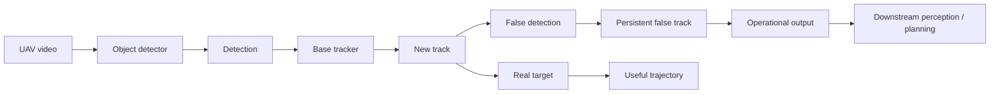
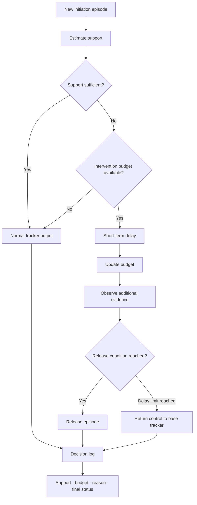
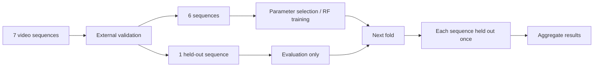

# Defense4UAVSwarm

**Interpretable control of track initiation in UAV video tracking.**

A false detection does not necessarily disappear after one frame. Once a
tracker assigns it an identity, the error can persist as a false track and
propagate to downstream perception or planning modules.

This project studies a simple question: **can weak new tracks be held back
briefly without changing the underlying tracker and without allowing the
intervention itself to grow uncontrolled?**

The proposed method adds a small decision layer around track initiation. It
delays only low-support initiation episodes, limits the total intervention
through an accumulated budget, and records the reason for every decision.

The method was evaluated on seven VisDrone video sequences with ByteTrack,
OC-SORT, and SORT. The clearest positive result was obtained with ByteTrack.

## Main result

With ByteTrack, the bounded delay affected 392 of 14,967 track-initiation
episodes (2.62%). It reduced:

- false observations from **46,368 to 45,943** (-425);
- false initiations from **10,031 to 9,855** (-176).

F1 remained within the predefined tolerance (0.403972 to 0.404400). The formal
intervention bound was checked on **29,385 video prefixes**, with **0 violations**.

For OC-SORT and SORT, tracking quality was preserved, but a statistically
reliable reduction in false observations was not established.

## Why track initiation matters

Raising the detector threshold can suppress false detections, but it can also
discard small, distant, or partly occluded real objects. The alternative studied
here is to leave the detector and base tracker unchanged and intervene only at
the moment when a weak new track would enter the output.



A single-frame detection error becomes more consequential when the tracker
assigns it an identity and propagates it through subsequent frames.

## Method

For each new initiation episode, the wrapper estimates support from information
available at the current frame. An episode with sufficient support passes
through normally. A weak episode is delayed only when the accumulated budget
permits an intervention. Additional observations can release it, while a finite
delay limit returns control to the base tracker.



The accumulated budget is part of the method rather than a tuning convenience:
it limits both the number of interventions and the resulting deviation from the
base tracker output. The rule is not a permanent rejection mechanism and does
not use a learned classifier.

Each decision remains inspectable through fields including `sequence_id`,
`tracklet_id`, `episode_id`, `frame_id`, `support`, `relative_confidence`,
`accumulated_support`, `budget_tokens_before`, `budget_tokens_after`,
`decision_status`, and `decision_reason`.

## Evaluation

The evaluation uses seven VisDrone video sequences in an external held-out
protocol. On each iteration, six sequences are available for parameter selection
or Random Forest training and one sequence is reserved for evaluation. The held-
out sequence rotates so that every sequence is evaluated once.



The held-out sequence is not used for training, threshold selection, or budget
tuning. Random Forest models are fitted again inside each fold. Features for a
new episode use no future frames or final tracklet information.

## Results

| Tracker | Baseline F1 | Delayed F1 | Finding |
| --- | ---: | ---: | --- |
| ByteTrack | 0.403972 | 0.404400 | False observations reduced |
| OC-SORT | 0.392258 | 0.392276 | Reduction not statistically confirmed |
| SORT | 0.391946 | 0.391942 | Reduction not statistically confirmed |

A budgeted Random Forest reduced false observations more strongly, but required
labelled initiation episodes and affected about 4.81% of new tracks. The proposed
rule does not use a learned classifier and affected about 2.60% on average across
folds (2.62% globally), while keeping the intervention amount explicitly bounded.
An unbounded Random Forest was also evaluated, but its intervention scale is not
directly comparable to the bounded rule.

The deviation bound was checked over every initial prefix used in the audit:

| Tracker | Active folds | Max D(n) | Max D(n)/(LQ·NQ) | Ratio to budget bound | Violations |
| --- | ---: | ---: | ---: | ---: | ---: |
| ByteTrack | 7 | 105 | 0.722 | 0.552 | 0 |
| OC-SORT | 1 | 27 | 1.000 | 0.675 | 0 |
| SORT | 1 | 27 | 1.000 | 0.659 | 0 |

Runtime was measured after warm-up over 30 repetitions. These values cover only
the additional decision layer; detector inference, base tracking, and Random
Forest training are excluded.

| Method | Runs | Mean ms/frame | Median | p95 |
| --- | ---: | ---: | ---: | ---: |
| RF | 30 | 0.481 | 0.488 | 0.517 |
| RF budgeted | 30 | 0.552 | 0.556 | 0.592 |
| Short-term delay | 30 | 0.901 | 0.899 | 0.925 |

## Interpretation

The result is not a general claim that delayed initiation improves every tracker.
The statistically supported reduction in false observations was obtained for
ByteTrack. OC-SORT and SORT retained essentially unchanged F1, but their
false-observation reductions were not statistically confirmed.

The main contribution is a controlled operating point: a small fraction of weak
initiations can be delayed without replacing the tracker, while the intervention
budget and decision log make the wrapper's behaviour explicit. No claim is made
about fewer route replanning events because a planning module was not part of the
experiment.

## Reproducing the study

The project requires Python 3.10 or newer. A local development environment can
be prepared with:

```bash
python -m venv .venv
source .venv/bin/activate
pip install -r requirements.txt
pip install -e .
pytest -q
```

VisDrone is distributed separately and is not included in this repository. See
the [official VisDrone repository](https://github.com/VisDrone/VisDrone-Dataset)
for access and licensing information.

The main experiment entry points are:

- [SORT evaluation](scripts/q1_v54/run_sort_v21_experiment.py)
- [Random Forest evaluation](scripts/q1_v54/run_rf_v21_experiment.py)
- [held-out parameter selection](scripts/q1_v54/run_nested_loso.py)
- [tracker comparison](scripts/q1_v54/build_unified_comparison_v7.py)
- [lifecycle analysis](scripts/q1_v54/build_false_track_lifecycle_v7.py)
- [intervention-bound audit](scripts/q1_v54/build_prefix_bound_audit_v7.py)
- [runtime measurement](scripts/q1_v54/benchmark_practical_runtime_v7.py)

Frozen experiment configurations are under [`configs/q1_v54/`](configs/q1_v54/).

## Repository layout

```text
configs/          experiment configurations
src/              method implementation and tracker adapters
scripts/          experiment, evaluation, and analysis entry points
tests/            automated tests
docs/             method and dataset notes
reproducibility/  earlier reproducibility manifests
```

## Publication

**Interpretable Control of Track Initiation with Predefined Intervention Bounds
in Unmanned Aerial Vehicle Perception Systems**

*Original title:* «Интерпретируемое управление инициацией треков с заранее
заданными границами вмешательства в системах восприятия беспилотных летательных
аппаратов»

Yuri V. Trofimov, Alexey N. Averkin, Alexey V. Shevchenko, Egor M. Kuznetsov,
Alexander D. Lebedev

The DOI and publisher link will be added when available.

## Funding

This research was carried out within the State Assignment of the Ministry of
Science and Higher Education of the Russian Federation, topic No.
124112200072-2.

<details>
<summary>Original Russian funding statement</summary>

Исследование выполнено в рамках государственного задания Министерства науки и
высшего образования Российской Федерации, тема № 124112200072-2.

</details>

## Limitations

The evaluation covers seven VisDrone video sequences and should not be
interpreted as evidence of universal improvement across trackers or camera
conditions. The statistically supported reduction in false observations was
obtained for ByteTrack; the corresponding effect was not confirmed for OC-SORT
or SORT.

The Random Forest baselines use labelled training episodes, while the proposed
rule does not. Runtime measurements cover the additional decision layer rather
than the complete detector-tracker pipeline.

The study does not establish deployment safety or performance in a real planning
system. Evaluation on independent datasets and cameras is still needed.

## Citation

Citation metadata for the software and associated article is provided in
[`CITATION.cff`](CITATION.cff).

## License

The source code is available under the [MIT License](LICENSE). VisDrone and other
external datasets retain their own terms and are not redistributed here.

<details>
<summary>Earlier research in this repository</summary>

The repository predates the track-initiation study. Earlier experiments covered
detector robustness, adversarial perturbations, T-norm diagnostics, and
tracking-aware filtering.

Those stages are preserved in the Git history and codebase, but they are not the
primary result described in this README.

</details>
